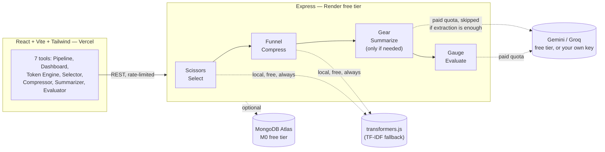

<p align="center">
  
</p>

<h1 align="center">Context Toolkit</h1>
<p align="center">
  <b>Send your model exactly what it needs. Nothing else.</b><br/>
  A full context-engineering pipeline — selection, compression, summarization, and evaluation —
  built on a genuinely $0 infrastructure stack.
</p>

<p align="center">
  <a href="#getting-started">Getting Started</a> ·
  <a href="#architecture">Architecture</a> ·
  <a href="#testing">Testing</a> ·
  <a href="docs/BUILD_LOG.md">Full Development Log</a> ·
  <a href="docs/WRITEUP.md">Resume/Portfolio Writeup</a>
</p>

---

## Screenshots


**Live demo:** _add your deployed link here once you've followed the deploy steps below_

---

## The problem

Most of what people paste into an LLM's context window is noise — irrelevant chunks, redundant
sentences, entire documents included "just in case." That costs tokens, adds latency, costs money,
and often makes the answer *worse* by burying the signal the model actually needs.

This toolkit is the fix, built end to end rather than as isolated demos: select the relevant
chunks with embeddings and MMR, compress what's left extractively, upgrade to a real LLM summary
**only** when extraction demonstrably falls short, and then prove the whole thing worked with a
real raw-vs-engineered answer comparison — not an assumed claim.

## Key features

- **7 tools** — a flagship Pipeline that composes everything, a Dashboard with real usage
  analytics, and 5 standalone utilities (Token Counter, Context Selector, Compressor, Summarizer,
  Evaluator)
- **Cost-conscious by design** — the Pipeline only spends an LLM call when free extractive methods
  measurably aren't enough, and reports why either way
- **Bring-your-own-key** — visitors can use their own Gemini/Groq key, bypassing the app's shared
  rate limit entirely, kept in memory only, never persisted
- **Light/dark theme**, Apple-inspired design system, fully responsive (sidebar collapses to a
  mobile top bar)
- **45 automated tests** across every interactive component — real simulated clicks, real state
  assertions, not just build checks
- **Genuinely free to run** — local embeddings, extractive compression, and 5 of 7 tools need zero
  API keys; the rest run on free tiers with no credit card required anywhere in the stack

## Architecture



## Tech stack

| Layer | Choice |
|---|---|
| Frontend | React 18, Vite, Tailwind CSS, Recharts |
| Backend | Node.js, Express |
| Embeddings | transformers.js (local, free) with automatic TF-IDF fallback |
| Tokenization | `js-tiktoken` |
| LLM | Gemini 2.5 Flash-Lite / Groq Llama 3.1 (free tiers, or bring-your-own-key) |
| Persistence | MongoDB Atlas (free M0 tier, optional) |
| Testing | Vitest, React Testing Library, jsdom |
| Hosting | Vercel (frontend) + Render (backend), both free tier |

## Why $0 infrastructure

Every piece here is genuinely free, not a crippled trial. Local embeddings mean selection costs
nothing no matter how many times you run it. Extractive compression is pure computation — zero API
calls. The LLM only gets involved when the free path demonstrably isn't enough. Free tiers on
Gemini/Groq, MongoDB Atlas, and Render/Vercel cover a real working demo without ever reaching for a
credit card — the rate limiter and bring-your-own-key support exist specifically so that stays true
even under public traffic.

---

## Getting started

**Prerequisites:** Node.js 18+

```bash
# 1. Backend
cd server
cp .env.example .env
npm install
npm run dev          # http://localhost:3001

# 2. Frontend (separate terminal)
cd client
cp .env.example .env
npm install
npm run dev           # http://localhost:5173
```

Open `http://localhost:5173`. Five of the seven tools work immediately with zero configuration.
For the two that need an LLM (Summarizer, Evaluator) and the full Pipeline, either add a free key
to `server/.env`:

```bash
GEMINI_API_KEY=your-key-here   # free at aistudio.google.com, no card required
```

...or click **Settings** in the sidebar and paste your own key in directly — no restart needed.

## Testing

```bash
cd client
npm test          # 45 tests across 14 files, real DOM interaction tests
```

## Deploying (still $0)

- **Frontend →** Vercel (root directory `client`, framework preset Vite)
- **Backend →** Render free web service (root directory `server`, build `npm install`, start `npm start`)
- Set `CLIENT_ORIGIN` on Render to your Vercel URL, and `VITE_API_URL` on Vercel to your Render URL
- Render's free tier sleeps after 15 minutes idle — the app detects this and shows a "waking up"
  message on first load rather than looking broken

---

## Project structure

```
server/
  src/
    routes/       API endpoints — health, tokens, context, compress, summarize, evaluate, pipeline, dashboard
    services/      Core logic — chunking, embeddings, compression, summarization, LLM client, pipeline orchestration
    db/             MongoDB models (optional, graceful no-op if unconfigured)
    middleware/       Rate limiting

client/
  src/
    components/    All 7 tool UIs + shared UI (Sidebar, Home, Logo, ThemeToggle, SettingsPanel)
    context/        Theme + API key state
    api/             Fetch wrappers, one per backend route group
    test/             45 automated interaction tests
```

Full file-by-file breakdown, including every service and component: see the
[development log](docs/BUILD_LOG.md).

## The full story

This README is deliberately the short version. The [development log](docs/BUILD_LOG.md) has the
complete build history — every one of the 8 phases, 3 real bugs found and fixed with the exact
testing that caught them, the design system decisions, and an honest account of one debugging dead
end (a hypothesis that didn't pan out, documented rather than hidden). Worth reading if you want to
see the actual engineering process, not just the finished result.

## License

MIT
