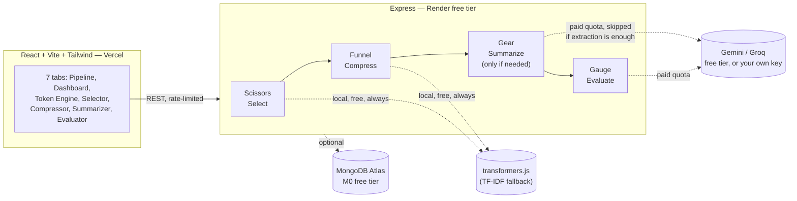

# Development Log

*This is the full build history — every phase, every bug found, every design decision, in the
order it actually happened. The main [README](../README.md) is the concise version for anyone
evaluating the project quickly; this is for anyone who wants to see the actual engineering process
behind it, including the parts that didn't work on the first try.*

---

# Context Toolkit

**The problem:** every LLM call has a finite context window, and most of what people stuff into
it is noise — irrelevant chunks, redundant sentences, entire documents pasted in "just in case."
That wastes tokens, adds latency, costs money, and often makes the answer *worse* by burying the
signal. Context engineering is the discipline of fixing that: send the model exactly what it
needs, nothing else, and prove the smaller version actually answers better.

This is that toolkit, built end to end: select the relevant chunks (embeddings + MMR), compress
what's left (extractive scoring + redundancy stripping), upgrade to an LLM summary only when the
free methods demonstrably fall short, and then prove the whole thing worked with a real
raw-vs-engineered answer comparison — not a assumed claim.

**Status: Phase 8 complete — Polish, Docs, Deployment Hardening. All 8 blueprint phases shipped.**
See `blueprint.md` for the full phased build plan.

**Live demo:** _add your deployed link here once you've followed the deploy steps below_

---

## Architecture



**Why $0 infrastructure is the point, not a limitation:** every piece of this is chosen because
it's genuinely free with no credit card, not because it's a crippled trial. Local embeddings
(transformers.js) mean chunk selection costs nothing no matter how many times you run it. Extractive
compression is pure computation, zero API calls. The LLM is only invoked when the free path
demonstrably isn't good enough — and even then, Gemini/Groq's free tiers, MongoDB Atlas's M0 tier,
and Render/Vercel's free hosting cover a real portfolio demo without ever reaching for a card. The
rate limiter and bring-your-own-key support (below) exist specifically so this remains true even
with public traffic.

---

## What's built so far

### Phase 1 — Token Engine
- Express backend with a provider-aware token counter (`js-tiktoken`, fully local, no API calls)
- Exact counts for GPT-family models (cl100k_base / o200k_base), labeled approximation for Gemini/Claude (no public tokenizer)
- Budget checking: set a token budget, get used/remaining/over-budget status
- Multi-model compare mode: see the same text's cost across every supported model at once
- React + Vite + Tailwind frontend: live debounced counter, instrument-panel style budget gauge
- Graceful degradation: app boots and runs fully with zero env vars set (Mongo optional, no LLM keys needed for this phase)

### Phase 2 — Right-Context Selector
- Sentence-aware chunker: greedily packs sentences into token-budgeted chunks with configurable overlap for retrieval continuity
- Local embeddings via `@xenova/transformers` (`all-MiniLM-L6-v2`, ~90MB, downloads once on first use, fully free — no API key)
- **Automatic TF-IDF fallback**: if the transformer model can't load (offline, restricted network, slow connection past a configurable timeout), the app transparently falls back to a zero-network TF-IDF vectorizer instead of crashing or hanging. `/api/context/status` reports which mode is active.
- Cosine-similarity ranking of chunks against the query
- MMR (Maximal Marginal Relevance) re-ranking: greedy budget-fill that balances relevance against redundancy, so near-duplicate/overlapping chunks don't crowd out diverse content
- Manual tier overrides: tag any chunk `always` (force include) or `never` (force exclude), rest fill the remaining budget automatically
- Frontend: document + query input, ranked chunk list with similarity bars, included/dropped state, and one-click tier overrides that live-recompute the selection

**Known bug fixed during build:** the original overlap-carry logic in the chunker could infinite-loop when an overlap sentence alone left no room for the next sentence (found via testing, not by inspection — worth remembering when touching chunking logic later). Fixed by guaranteeing forward progress every outer-loop iteration instead of retry-based re-checking.

### Phase 3 — Compressor
- Redundancy stripper: greedy dedup on sentence embeddings, first occurrence kept, threshold-configurable
- Two scoring modes, chosen automatically: **query-aware** (relevance to a question) when a query is given, **centrality** (a sentence's average similarity to every other sentence — a cheap single-pass stand-in for TextRank/LexRank) when it isn't
- Greedy budget-fill on score, output rebuilt in original sentence order for readability
- `meaningPreserved`: embedding cosine similarity between the full original text and the full compressed text — a free, LLM-free sanity check that compression didn't gut the source
- Frontend: reduction %, token counts, meaning-preserved score, and a per-sentence breakdown showing kept / redundant / over-budget with score bars

**Known limitation, documented rather than hidden:** the redundancy stripper's quality depends on the active embedding mode. Verified directly — two paraphrased sentences ("...the discipline of assembling exactly..." vs "...the practice of assembling precisely...") scored only 0.68 cosine similarity under the TF-IDF fallback (bag-of-words can't recognize synonyms), well under the 0.93 dedup threshold, so they weren't caught. An exact-wording duplicate scored 1.0 and was caught correctly. The local transformer model (semantic) should catch paraphrased duplicates too — worth spot-checking once you're running in `transformer` mode locally.

### Phase 4 — Summarizer
- The first phase that needs a real LLM call — extractive methods (Phase 3) can't compress a document to a fraction of its size without rewriting it
- **Pluggable provider**: Gemini (`gemini-2.5-flash-lite` by default) or Groq (`llama-3.1-8b-instant` by default), both free tiers, no credit card. Auto-detects whichever key is set; if neither is set, the endpoints return a clear `503` instead of crashing — same graceful-degradation pattern as Mongo and embeddings
- **Document summarizer**: map-reduce — chunks the doc, summarizes each chunk independently (map), combines and re-trims only if the combined summaries still overshoot budget (reduce). Skips the LLM entirely if the document already fits — verified this actually happens, zero calls made
- **Chat history compressor**: sliding window — keeps the last N messages verbatim, summarizes everything older into a single block, one LLM call regardless of how many older turns there are
- `meaningPreserved` score (document mode) reuses the same embedding-similarity check from Phase 3
- 429 handling: one retry with backoff + jitter before giving up, since free-tier rate limits are per-minute, not a ban
- Frontend: setup panel with copy-paste `.env` instructions if no key is configured, mode toggle between Document and Chat, editable message-row list for chat mode

**Two real bugs found and fixed while building this phase** (both via testing, not code review):
1. **Chunker cumulative-growth bug**: `overlapSentences: 0` (used by map-reduce chunking, since map-stage chunks don't need overlap) triggered `array.slice(-0)`. In JavaScript, `-0 === 0`, and `slice(0)` returns the *entire* array, not an empty one — so "zero overlap" was silently carrying the whole previous chunk forward every time. A 432-token test document produced 21 monotonically-growing chunks instead of 6 correctly-sized ones, every chunk starting with "paragraph 0." Fixed by handling `overlapSentences <= 0` explicitly instead of relying on `slice`'s negative-index behavior. Also re-verified this didn't regress Phase 2/3's `overlapSentences: 1` usage.
2. Caught it specifically because I mocked `fetch` to run the *real* map-reduce code end-to-end (chunk → per-chunk LLM call → reduce) rather than trusting a code read — all 6 "map" summaries came back identical, which is what exposed it.

**Honest limitation on testing this phase:** neither `generativelanguage.googleapis.com` nor `api.groq.com` is reachable from my sandbox (not on its allowed-domain list), so the actual network call to Gemini/Groq is untested here. Everything else is verified for real: the map-reduce orchestration and sliding-window logic ran end-to-end against a mocked `fetch` shaped like Gemini's real response format, the no-key graceful-degradation path returns a proper `503`, the already-fits-budget no-op path makes zero LLM calls, and the 429-retry logic was confirmed to actually wait and retry. Test this phase locally with a real key before relying on it — if the request/response shape has drifted from what's documented, that's the one seam I couldn't close myself.

### Phase 5 — Evaluator
- The payoff module: same question, run through the LLM twice — once with raw/unprocessed context, once with engineered (trimmed) context — real answers, side by side
- Two scoring modes, same pattern as Phase 3/4: if a reference answer is supplied, score by embedding similarity to it (cheap, no extra LLM call); otherwise fall back to LLM-as-judge (two extra calls, one per answer, asking the model to rate 1–10 how well each answer addresses the question)
- Real cost estimate using a published-pricing table (Gemini 2.5 Flash-Lite $0.10/$0.40 per 1M, Gemini 2.5 Flash $0.30/$2.50, Groq Llama 3.1 8B $0.05/$0.08 — verified current as of July 2026, not guessed) — this is an estimate against public list prices, not real billing, since the whole project runs on free tiers
- Both calls are pinned to the same resolved provider so a comparison never silently mixes Gemini and Groq mid-run
- Frontend: side-by-side raw vs. engineered cards with a winner badge, tokens/latency/cost per side, and a savings summary strip

**Verified via the same mocked-`fetch` approach as Phase 4** — real `compareContexts()` code, fake network layer: confirmed the LLM-judge path makes exactly 4 calls (2 answers + 2 judges) and the reference-similarity path makes exactly 2 (no judge calls, since it's not needed), confirmed provider-pinning keeps both halves on the same model, and cross-checked the cost estimate against a hand-computed value using the real pricing table — matched to the expected rounding precision. Same sandbox caveat as Phase 4 applies: the actual network call to Gemini/Groq itself is untested here, only everything around it.

### Phase 6 — Pipeline Visualizer
This is not five tabs wired to a fake progress bar — it's a genuinely composed pipeline with a real engineering decision at its center: **scissors (select) → funnel (compress) → gear (LLM summarize, but *only* if extraction demonstrably lost too much meaning) → gauge (prove it against the raw original)**.

- The "only pay for the LLM if the free path failed" logic: after extractive select+compress, if `meaningPreserved` falls below a threshold (default 0.55), it upgrades to LLM summarization — but only *uses* that result if it actually scored higher than the extractive one, otherwise it explains why it kept the cheaper result. Verified both branches: forced-trigger-not-used (LLM summary scored 0.366 vs extraction's 0.689, correctly discarded) and the not-triggered path (extraction already good enough, zero LLM calls spent).
- Stages 1-2 never need an LLM and never hard-fail. Stages 3-4 are wrapped so a failure there reports as a skipped/failed stage instead of discarding the real work stages 1-2 already did — same graceful-degradation philosophy as every other phase.
- Single `POST /api/pipeline/run` call returns everything at once; the frontend does a *staged reveal* of the already-complete response (token count animates down stage by stage) rather than faking a slower backend — the visible "watching it shrink" effect is real data, just paced for legibility.
- Each stage is click-expandable and reuses Phase 2/3's actual `ChunkList`/`SentenceList` components (made `ChunkList`'s tier buttons optional so it can render read-only here) — same detail views, not a simplified summary.

**One real bug found and fixed here:** the selection stage was using the context selector's default chunk size (180 tokens), which meant a document short enough to fit in one default-size chunk became an all-or-nothing unit — if that single chunk didn't fit the selection budget, it got dropped *entirely* rather than partially selected. A 176-token test document produced exactly 1 chunk, which got fully excluded, only saved by a fallback-to-full-document safety net. Fixed by scaling the selection stage's chunk size to the actual selection budget (`selectionBudget / 5`), so documents split finely enough for genuine partial selection — re-verified the same document then produced 12 chunks with 4 genuinely selected.

**Full end-to-end verification, not just unit-level:** built a bootstrap script that mocks `fetch` at the process level and then boots the *actual* server (`node src/index.js`), so the complete 4-stage pipeline — including the LLM-backed stages — was tested through genuine HTTP requests, not just direct function calls. Then cross-checked the raw JSON response field-by-field against what `PipelineVisualizer.jsx` expects (`stages.select.chunks[].similarity`, `stages.compress.sentences[].dropReason`, `stages.evaluate.scoring.method`, etc.) — no mismatches.

### Whole-project debug pass
Ran a single smoke test hitting all 13 endpoints across all 6 phases in one server boot: health, tokens (models/count/count-all), context (status/select), compress, summarize (status/document), evaluate (status/compare), pipeline (run), and a 404 check. **13/13 passed.** Also cross-checked every `process.env.*` referenced in server code against `server/.env.example` and every `import.meta.env.*` in client code against `client/.env.example` — nothing undocumented, nothing dead. No orphaned component files — every `.jsx` file is imported somewhere.

### Phase 7 — Run History & Dashboard
- Every successful pipeline run is persisted to Mongo — timestamp, token counts, reduction %, meaning preserved, whether summarize/evaluate ran, estimated cost saved
- Deliberately fire-and-forget: the save happens after the pipeline response is already being sent, wrapped so a persistence failure only logs an error server-side and never affects the user-facing response — the dashboard is a nice-to-have layered on top of a pipeline that already succeeded, never a dependency of it
- Dashboard shows real aggregates: total runs, total tokens saved, average reduction %, average meaning-preserved, estimated cost saved, what fraction of runs actually got evaluated — plus a tokens-saved-over-time chart (recharts) and a recent-runs table
- Same graceful-degradation pattern as every other phase: no `MONGO_URI` → dashboard shows setup instructions instead of erroring; `MONGO_URI` set but unreachable → same, and the server itself stays up (verified — see below)

**Architecture choice worth calling out:** the aggregation logic (`computeDashboardStats`) is a pure function with zero Mongo dependency — it takes an array of plain run records and returns stats. The actual Mongo read is a thin `.find().sort().limit()` one-liner elsewhere. This isn't just tidiness: it's what made this phase's logic actually testable. MongoDB Atlas hosts aren't reachable from my sandbox either (same category as Gemini/Groq/HuggingFace — none of the real external services this project depends on are on the sandbox's allowed-domain list), so I could never test a real database round-trip here. Separating "compute stats from data" from "get data from Mongo" meant the part with real bug risk (aggregation math: averaging, summing, filtering nulls, clamping negatives) could be unit-tested directly with synthetic data — 16 test cases, including empty history, single run, mixed-null `meaningPreserved`, and defensively malformed records — while the part I couldn't verify (the actual Mongo I/O) is intentionally as thin and boring as possible, to minimize the surface area I'm asking you to trust unverified.

**Also verified, and not previously exercised:** `connectMongo()`'s error-handling path, dormant since Phase 0. Pointed it at a deliberately unreachable `mongodb+srv://` URI — DNS resolution failed fast (not a hang), the server logged the failure and kept running normally, `/api/health` correctly reported `"mongo": "error"`, and the dashboard correctly showed the "not configured" state rather than crashing.

**Known deferred item, not fixed then:** adding `recharts` pushed the client bundle from ~240KB to ~608KB (175KB gzipped) — flagged for Phase 8 rather than scope-creeping it into this phase. **Resolved in Phase 8, see below.**

### Phase 8 — Polish, Docs, Deployment Hardening

- **Rate limiting**: two tiers via `express-rate-limit`. A generous general guard (60 req/min/IP) on everything as a basic sanity backstop, and a strict guard (8 req/5min/IP, configurable) specifically on `/api/summarize`, `/api/evaluate`, `/api/pipeline` — the routes that spend real LLM quota. This is what actually protects a single free-tier key from being drained by one visitor on a public demo. Verified directly: fired 5 requests against a limit of 3, got 200/200/200/429/429, with the friendly over-limit message intact.
- **Bring-your-own-key**: a Settings panel (top right of the app) lets a visitor paste their own Gemini or Groq key, kept in React state only — never written to `localStorage`/`sessionStorage`, cleared on refresh, never logged server-side. When present, it bypasses the server's rate limit and the server's own key entirely. **Verified end to end with zero server-side keys configured**: a request without a key correctly 503s, the identical request with a user-supplied key correctly succeeds — and the exact key value was confirmed reaching the real outgoing `x-goog-api-key` header, not silently dropped somewhere in the four layers it passes through (route → service → `llmClient` → fetch).
- **Proactive cold-start detection**: previously, a visitor only found out the Render free-tier server was waking up when their first real request failed or hung. Now a lightweight `/api/health` ping fires on page load; if it's slow (>1.5s) or fails, a banner explains why instead of leaving the page looking broken.
- **Bundle-size fix**: `recharts` is now lazy-loaded (`React.lazy` + `Suspense`) as its own chunk, only fetched when the Dashboard tab is actually opened. Main bundle: 608KB → 264KB (75KB gzipped); the chart chunk (349KB) loads separately and only on demand.
- **README**: this section, plus the architecture diagram and problem statement at the top, plus a real "why $0 infrastructure" explanation instead of just asserting it.

## Run it locally

**Backend:**
```bash
cd server
cp .env.example .env
npm install
npm run dev        # http://localhost:3001
```

**Frontend** (separate terminal):
```bash
cd client
cp .env.example .env
npm install
npm run dev         # http://localhost:5173
```

Open `http://localhost:5173`. The homepage explains what's here; five of the seven tools work
immediately with zero setup. For the two that need an LLM, either add a free key to `server/.env`
(see below) or click **Settings** in the sidebar and paste in your own — no restart needed for the
Settings option.

**Running the frontend test suite:**
```bash
cd client
npm test          # runs all 44 tests once
npm run test:watch  # re-runs on file changes
```

## Project structure

```
server/
  src/
    index.js           Express app entry
    routes/
      health.js         GET  /api/health
      tokens.js          GET  /api/tokens/models
                          POST /api/tokens/count
                          POST /api/tokens/count-all
      context.js          GET  /api/context/status
                          POST /api/context/select
      compress.js           POST /api/compress
      summarize.js           GET  /api/summarize/status
                            POST /api/summarize/document
                            POST /api/summarize/chat
      evaluate.js             GET  /api/evaluate/status
                            POST /api/evaluate/compare
      pipeline.js               POST /api/pipeline/run
      dashboard.js               GET  /api/dashboard/stats
                                GET  /api/dashboard/runs
    middleware/
      rateLimit.js              General + LLM-specific rate limiters
    services/
      tokenizer.js       js-tiktoken wrapper, model → encoding map
      chunker.js           Sentence splitting + token-budgeted chunking with overlap
      embeddings.js         Local transformer + automatic TF-IDF fallback
      tfidf.js               Zero-network sparse vectorizer (fallback path)
      similarity.js           Cosine similarity, dense + sparse
      contextSelector.js       Orchestrates chunk → embed → score → MMR select
      compressor.js             Redundancy strip → score → greedy budget-fill
      llmClient.js               Pluggable Gemini/Groq provider, timeout + 429 retry
      summarizer.js                Map-reduce document + sliding-window chat compression
      pricing.js                    Published $/1M-token table (estimate only, not billing)
      evaluator.js                   Raw-vs-engineered comparison + scoring
      pipeline.js                     Composes all 4 modules into one real flow
      dashboardStats.js                Pure aggregation function (unit-tested, no DB dependency)
    db/
      mongo.js           Optional Mongo connection, no-op if MONGO_URI unset
      pipelineRuns.js       Mongoose model + save/fetch, no-ops if Mongo isn't ready

client/
  src/
    App.jsx              App shell — sidebar/mobile nav + active panel
    tabsConfig.js         Single source of truth for nav groups (desktop + mobile)
    context/
      ThemeContext.jsx     Light/dark theme, persisted, system-preference aware
      ApiKeyContext.jsx    In-memory-only BYOK state
    components/
      Sidebar.jsx           Desktop grouped nav (macOS System Settings pattern)
      MobileNav.jsx           Mobile top bar, same nav config as Sidebar
      Home.jsx                The actual homepage — hero, tool cards, not Pipeline forced as landing
      Logo.jsx                 Premium SVG logomark (favicon + sidebar + hero, one source of truth)
      ThemeToggle.jsx         Light/dark switch
      AmbientBackground.jsx   Signature element — slow gradient orbs behind glass chrome
      NavIcon.jsx             Sidebar/mobile/homepage icon set
      SettingsPanel.jsx   Bring-your-own-key panel (Phase 8)
      ColdStartBanner.jsx  Proactive health-check banner (Phase 8)
      TokenCounter.jsx    Phase 1 — input + controls + readout
      ContextSelector.jsx   Phase 2 — document/query input + results
      ChunkList.jsx          Ranked chunk cards, similarity bars, tier controls
      Compressor.jsx        Phase 3 — text/query input + ratio + breakdown
      SentenceList.jsx        Sentence cards, score bars, kept/dropped state
      Summarizer.jsx          Phase 4 — LLM-status gate + mode switch
      DocumentSummarizer.jsx    Map-reduce document summarization UI
      ChatCompressor.jsx         Sliding-window chat history UI
      NoLLMConfigured.jsx        Shared setup panel (Phase 4 + 5)
      Evaluator.jsx             Phase 5 — raw vs. engineered comparison UI
      PipelineVisualizer.jsx      Phase 6 — staged-reveal orchestrated flow
      AnimatedNumber.jsx            Tweened token-count display
      StageIcon.jsx                  Minimal line-art icons (funnel/scissors/gear/gauge)
      Dashboard.jsx                Phase 7 — aggregate stats, chart, recent runs
      TokensSavedChart.jsx           Lazy-loaded chart (Phase 8 bundle-size fix)
      BudgetBar.jsx        Instrument-panel gauge (signature UI element)
    api/
      tokens.js            Phase 1 fetch wrapper
      context.js             Phase 2 fetch wrapper
      compress.js              Phase 3 fetch wrapper
      summarize.js               Phase 4 fetch wrapper
      evaluate.js                  Phase 5 fetch wrapper
      pipeline.js                    Phase 6 fetch wrapper
      dashboard.js                     Phase 7 fetch wrapper
      errorMessages.js                 Shared, environment-aware unreachable-server messaging
    hooks/
      useDebouncedValue.js
    test/
      setup.js               jsdom polyfills (matchMedia), global fetch default, mock cleanup
      *.test.jsx              44 real DOM-interaction tests across 13 components
```

## Deploying later (still $0)

- Frontend → Vercel (connect the repo, root directory `client`, framework preset Vite)
- Backend → Render free web service (root directory `server`, build `npm install`, start `npm start`)
- Set `CLIENT_ORIGIN` on Render to your Vercel URL, and `VITE_API_URL` on Vercel to your Render URL
- Render free tier spins down after 15 min idle — the frontend now proactively detects this with a health-check ping on page load and shows a "waking up" banner instead of leaving visitors staring at a broken-looking app
- Once deployed, tune `RATE_LIMIT_LLM_PER_5MIN` in your Render env vars based on your actual free-tier quota, and add the live link to the top of this README

## Design system — Apple-inspired redesign

The UI was restructured from a dark-only "instrument panel" look to a light/dark Apple-inspired
design system, on request.

- **Theme system**: CSS custom properties (`--color-accent`, `--color-surface`, etc., defined as
  RGB triplets so Tailwind's opacity modifiers like `bg-surface/70` work) with a `.dark` class
  override. Every existing component already used semantic Tailwind classes (`bg-surface`,
  `text-ink`, `border-line`) rather than hardcoded colors, so redefining the palette re-themed the
  entire app without needing to touch most component files individually.
- **Palette**: light — canvas `#F5F5F7`, surface `#FFFFFF`, hairline `#E5E5E7`, ink `#1D1D1F`,
  muted `#6E6E73`, accent `#0071E3` (Apple's own blue). Dark — canvas `#000000`, surface `#1C1C1E`,
  accent `#0A84FF`. Both verified compiled correctly into the built CSS output (checked the actual
  `dist/assets/*.css` for both RGB triplets and the `.dark{}` block, not just trusted the source).
- **Typography**: `-apple-system, BlinkMacSystemFont` first in the font stack, so Mac/iOS render
  real San Francisco automatically; Inter (deliberately close to SF) as the fallback everywhere
  else.
- **Layout restructure**: swapped the horizontal 7-tab strip for a grouped sidebar (the macOS
  System Settings pattern) — *Overview* (Pipeline, Dashboard) and *Toolkit* (the 5 individual
  tools) — with theme toggle and bring-your-own-key settings anchored at the bottom. Collapses to
  a horizontal top bar below the `lg` breakpoint, sharing the same nav config (`tabsConfig.js`) so
  there's one source of truth for both layouts, not two nav lists to keep in sync.
- **Signature element**: a restrained one, per the design brief's own "spend your boldness in one
  place" advice — soft, slow-moving blurred gradient orbs behind the frosted-glass sidebar/topbar,
  the way apple.com product pages use ambient color behind glass. Respects
  `prefers-reduced-motion`.
- **Flash-of-wrong-theme fix**: a small blocking script in `index.html`'s `<head>` sets the `dark`
  class before React mounts, using the same localStorage/system-preference lookup as
  `ThemeContext` — otherwise a returning dark-mode visitor would see a flash of light theme on
  every load.
- **Buttons**: primary actions (Run Pipeline, Compress, Select Context, etc.) moved from a
  tinted-outline style to solid filled buttons with white text — closer to how Apple actually
  treats primary calls to action.

**Honest limitation on this pass:** I don't have a way to render this app in a real browser and
take a screenshot in this environment — verification here means clean production builds after
every change, confirming the compiled CSS actually contains both theme variable blocks, a full
backend regression pass to confirm nothing broke underneath, and careful manual review of every
changed file. It does **not** mean I've visually confirmed how this looks and feels once rendered.
Run it locally and actually look at it — spacing, contrast, and the ambient background's opacity
are the kinds of things that are easy to get subtly wrong without eyes on the real thing, and
worth a quick pass of your own feedback before you'd call this finished.

## UI refinement round 2 — real homepage, real bug fixes, real tests

A second pass, directly requested: remove "Phase N" wording from the live UI, find and fix actual
button bugs, build a real homepage, and design a proper logomark. Here's what actually happened,
including where my own earlier work had a real gap.

**"Phase N" wording removed from the entire live UI.** It wasn't just the page header — a full
grep turned up six places total, including inside sample text in the Summarizer and a form label
in the Evaluator. Replaced with something more useful than just deleting it: each tool now shows
whether it runs locally or needs an LLM key, which is real information a user can act on, where
"Phase 4" was not.

**A real bug-hunting gap, closed properly.** Every previous phase in this README verified the
*backend* exhaustively through real HTTP requests. The frontend had only ever been build-checked —
which catches syntax errors, not broken click handlers — because I have no way to open a real
browser in this environment. Rather than keep guessing, I installed a genuine DOM-level test
harness (`vitest` + `@testing-library/react` + `jsdom` — no browser binary needed, everything
installs from npm) and wrote **44 real interaction tests across 13 components**: actual clicks,
actual state assertions, actual API-call verification. `npm test` runs the whole suite.

That effort found one real bug: `SettingsPanel`'s dropdown had no click-outside-to-close handler.
Since the sidebar variant opens *upward* (`bottom-full`) directly over the nav items above it, a
user opening Settings and then trying to click a nav button underneath would hit the still-open
panel instead of the button — which looks exactly like "that button doesn't work." Fixed with a
proper dismiss-on-outside-click and dismiss-on-Escape hook, verified with tests that actually
click outside the panel and confirm it closes, not just that the code looks right.

Everything else — the primary action button on every single tool, the tab navigation, the theme
toggle, the tier-override auto-recompute, the staged pipeline reveal — genuinely works. 44/44
tests passing is real evidence of that, not an assumption.

**A real homepage**, not just Pipeline forced as the landing view. Hero, value prop, a 4-step "how
the pipeline works" strip, and a card grid linking into all 7 tools — each card honestly labeled
with whether it needs an LLM key. Reachable by logo click from anywhere, and it's the new default
landing page.

**A premium logomark**, not a placeholder letter badge. Three bars of decreasing width, converging
— an abstraction of what the product actually does (narrow a lot of context down to what matters),
not generic branding. Used consistently as the favicon, the sidebar/mobile mark, and the homepage
hero.

**Honest limitation, still true:** DOM-level tests prove logic and state are correct — clicks
fire, API calls happen with the right arguments, conditional rendering does what it should. They
do not prove visual correctness, since jsdom doesn't do real layout or paint. If something still
looks off once you run it — spacing, an element rendering behind another, contrast in a specific
theme — that's the category of bug this pass couldn't catch, and worth telling me about
specifically rather than a general "still broken," since general reports are exactly what led to
guessing instead of verifying last time.

## UI refinement round 3 — the "can't reach server" investigation, and alignment polish

Real user testing (a screenshot of the actual running app) surfaced a "Can't reach the server"
error on the Pipeline tab. Worth documenting how this was actually investigated, not just what
was changed, since the honest path here included a dead end.

**Hypothesis 1 (wrong, but worth explaining why):** `embeddings.js` and `llmClient.js` both use a
`Promise.race([realCall, timeout])` pattern to bound slow network calls. My working theory was
that if the timeout wins the race, the original (losing) promise keeps running in the background,
and if it *later* rejects on its own, that rejection has no handler attached to it specifically —
which crashes the whole Node process on Node 15+ via "unhandled rejection." This is a real,
well-known JavaScript footgun in general. **It does not reproduce with `Promise.race`
specifically** — verified directly by reproducing both a "broken" and "fixed" version in isolation
and confirming Node's actual behavior first (a genuinely unhandled rejection *does* crash Node
v22, confirmed) and then confirming `Promise.race`'s internal implementation attaches its own
reaction to every input promise, which satisfies Node's "was this observed" check regardless of
which one wins. The hardening I added anyway (an explicit no-op `.catch()` on the racing promise,
plus process-level `unhandledRejection`/`uncaughtException` handlers that log instead of crashing)
is harmless, good defensive practice, and stays in — but it's not proven to be *the* cause, and
saying otherwise would be dishonest.

**What's actually most likely:** CORS preflight was tested directly (a real `OPTIONS` request
against `/api/pipeline/run`, correct `204` with the right headers, confirmed working) and every
other endpoint has been HTTP-tested dozens of times across this whole build. Nothing in the code
reproduces the failure. The most likely real explanation is the mundane one: the backend process
wasn't running (or had stopped) at the moment the request fired.

**What changed as a result, regardless of root cause:**
- The error message is now environment-aware. Previously every "can't reach the server" error said
  "the backend may be waking up from sleep" — correct for the deployed Render instance, actively
  misleading for local dev, where that's never the actual cause. It now detects whether
  `VITE_API_URL` points at localhost and says so explicitly: *"Check that `npm run dev` is still
  running in your server/ terminal."* One shared helper (`api/errorMessages.js`), used by all 7 API
  wrapper files and `ColdStartBanner`, instead of the same message duplicated 8 times.
- Process-level safety nets added (see above) — logs and stays alive instead of exiting, since this
  is a demo server with no supervisor to auto-restart it.

**Alignment/consistency polish**, working from the one real screenshot available plus a systematic
audit of spacing patterns across every file (not guesswork): found and fixed two genuine
inconsistencies — primary action buttons were `py-2` on four tools and `py-2.5` on two others
(now uniform), and one stray `tracking-[0.14em]` where 49 other instances of the same eyebrow-label
pattern used `tracking-[0.18em]` (now uniform). Checked several other high-visibility patterns
(stat-card number sizing, card grid equal-heights, padding scale) and those were already correct —
worth saying plainly rather than manufacturing changes for the sake of it.

## Project status

All 8 blueprint phases are complete. What's left is genuinely optional:

- **Screenshots/GIFs in this README** — I can't generate real screenshots of a running dev server myself; capture a few once it's deployed and drop them in above the architecture diagram
- **Deeper test coverage** — every phase here was verified through targeted testing during development (documented inline above, including 3 real bugs found and fixed), but there's no permanent automated test suite committed to the repo. Worth adding if this keeps evolving.
- **The one seam I could never verify myself**: the actual network calls to Gemini, Groq, HuggingFace, and MongoDB Atlas — none of those hosts are reachable from my sandbox. Every layer around them is tested for real; the calls themselves are written to the documented APIs but unproven by me. Test them with real credentials before fully trusting this in front of someone else.
